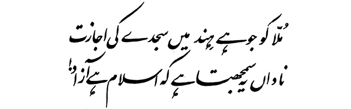

# Traveler's Abode - Backend

## About

Backend for Traveler's Abode.

## Naming

> عَبْدِ اللَّهِ بْنِ عُمَرَ ـ رضى الله عنهما ـ قَالَ أَخَذَ رَسُولُ اللَّهِ صلى الله عليه وسلم بِمَنْكِبِي فَقَالَ كُنْ فِي الدُّنْيَا كَأَنَّكَ غَرِيبٌ، أَوْ عَابِرُ سَبِيلٍ
> 
> Abdullah bin Umar said, "Allah's Messenger (ﷺ) took hold of my shoulder and said, 'Be in this world as if you were a stranger or a traveler.'"

[Sahih al-Bukhari 6416](https://sunnah.com/bukhari:6416)

## Inspiration

Allama Iqbal (رح) wrote this in the context of the situation of the Muslims in India, however its words are still extremely relevant today. 

## Tech Stack 

### Backend 

* [Rocket](https://rocket.rs) - Webserver
* [Prisma](https://prisma.brendonovich.dev/getting-started/setup) - ORM
* [MySQL](https://www.mysql.com/) - Database
  * This does not matter at all, I can swap to another database simply by changing the `datasource` in [`backend/prisma/schema.prisma`](https://github.com/proudmuslim-dev/abode-backend/blob/main/backend/prisma/schema.prisma). From a developer POV, the actual database doesn't matter because Prisma provides an abstraction layer independent of it.
* [JWT](https://jwt.io/) - Authentication
  * Here, we use the [jsonwebtoken](https://github.com/Keats/jsonwebtoken#readme) crate. Implementation details can be found in the [`backend/src/routes/utils/jwt.rs`](https://github.com/proudmuslim-dev/abode-backend/blob/main/backend/src/routes/utils/jwt.rs) file.

### Frontend 

* [Rocket](https://rocket.rs) - Webserver
* [Tera](https://tera.netlify.app/) - Templates 
  * It is used with [rocket\_dyn\_templates](https://api.rocket.rs/v0.5-rc/rocket_dyn_templates/index.html) for easy integration with Rocket. 
* [Reqwest](https://docs.rs/reqwest/latest/reqwest/) - HTTP client (for querying the backend)

